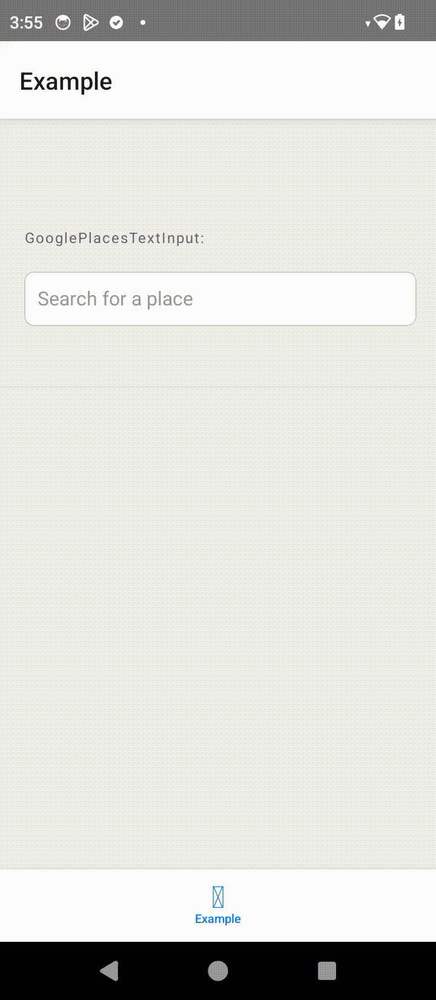

# React Native Google Places Autocomplete TextInput

A customizable React Native TextInput component for Google Places Autocomplete using the Places API (New)

## Features

- Fully customizable UI
- Debounced search
- Clear button (x)
- Loading indicator
- Keyboard-aware
- Custom place types filtering
- RTL support
- Multi-language support
- TypeScript support

## Preview

<table>
  <tr>
    <td></td>
  </tr>
</table>

## Installation

```bash
npm install react-native-google-places-textinput
# or
yarn add react-native-google-places-textinput
```

## Prerequisites

1. **Enable the Places API (New)** in your Google Cloud Project
   - This component specifically requires the new `Places API (New)`, not the legacy `Places API`
   - In the [Google Cloud Console](https://console.cloud.google.com/), go to `APIs & Services` > `Library` and search for "*Places API (New)*"

2. **Create an API key**
   - Go to "APIs & Services" > "Credentials" and create a new API key
   - Under "API restrictions", make sure "Places API (New)" is selected

## Usage

### Basic Example
```javascript
import GooglePlacesTextInput from 'react-native-google-places-textinput';

const YourComponent = () => {
  const handlePlaceSelect = (place) => {
    console.log('Selected place:', place);
  };

  const basicStyles = {
    container: {
      width: '100%',  // Ensure full width
      paddingHorizontal: 16,
    },
    input: {
      height: 40,  // Comfortable touch target
    }
  };

  return (
    <GooglePlacesTextInput
      apiKey="YOUR_GOOGLE_PLACES_API_KEY"
      onPlaceSelect={handlePlaceSelect}
      style={basicStyles}
    />
  );
};
```

<details>
<summary>Example with Places API Configuration</summary>

```javascript
const ConfiguredExample = () => {
  const handlePlaceSelect = (place) => {
    console.log('Selected place:', place);
  };

  return (
    <GooglePlacesTextInput
      apiKey="YOUR_GOOGLE_PLACES_API_KEY"
      onPlaceSelect={handlePlaceSelect}
      languageCode="fr"
      types={['restaurant', 'cafe']}
      includedRegionCodes={['fr', 'be']}
      minCharsToFetch={2}
    />
  );
};
```
</details>

<details>
<summary>Example with Full Styling</summary>

```javascript
const StyledExample = () => {
  const handlePlaceSelect = (place) => {
    console.log('Selected place:', place);
  };

  const customStyles = {
    container: {
      width: '100%',
      marginHorizontal: 0,
    },
    input: {
      height: 45,
      borderColor: '#ccc',
      borderRadius: 8,
    },
    suggestionsContainer: {
      backgroundColor: '#ffffff',
      maxHeight: 250,
    },
    suggestionItem: {
      padding: 15,
    },
    suggestionText: {
      main: {
        fontSize: 16,
        color: '#333',
      },
      secondary: {
        fontSize: 14,
        color: '#666',
      }
    },
    loadingIndicator: {
      color: '#999',
    },
    placeholder: {
      color: '#999',
    }
  };

  return (
    <GooglePlacesTextInput
      apiKey="YOUR_GOOGLE_PLACES_API_KEY"
      placeHolderText="Search for a place"
      onPlaceSelect={handlePlaceSelect}
      style={customStyles}
    />
  );
};
```
</details>

## Props

| Prop | Type | Required | Default | Description |
|------|------|----------|---------|-------------|
| **Essential Props** |
| apiKey | string | Yes | - | Your Google Places API key |
| **Input Configuration** |
| value | string | No | '' | Initial input value |
| placeHolderText | string | No | - | Placeholder text for input |
| minCharsToFetch | number | No | 1 | Minimum characters before fetching |
| debounceDelay | number | No | 200 | Delay before triggering search |
| **Places API Configuration** |
| proxyUrl | string | No | - | Custom proxy URL for Places API requests |
| languageCode | string | No | - | Language code (e.g., 'en', 'fr') |
| includedRegionCodes | string[] | No | - | Array of region codes to filter results |
| types | string[] | No | [] | Array of place types to filter |
| biasPrefixText | string | No | - | Text to prepend to search query |
| **UI Customization** |
| style | StyleProp | No | {} | Custom styles object |
| showLoadingIndicator | boolean | No | true | Show/hide loading indicator |
| showClearButton | boolean | No | true | Show/hide the input clear button |
| forceRTL | boolean | No | undefined | Force RTL layout direction |
hideOnKeyboardDismiss | boolean | No | false | Hide suggestions when keyboard is dismissed
| **Event Handlers** |
| onPlaceSelect | (place: Place \| null) => void | Yes | - | Callback when place is selected |
| onTextChange | (text: string) => void | No | - | Callback triggered on text input changes |

## Methods

The component exposes the following methods through refs:

- `clear()`: Clears the input and suggestions
- `focus()`: Focuses the input field

```javascript
const inputRef = useRef(null);

// Usage
inputRef.current?.clear();
inputRef.current?.focus();
```

## Styling

The component accepts a `style` prop with the following structure:

```typescript
type Styles = {
  container?: ViewStyle;
  input?: TextStyle;
  suggestionsContainer?: ViewStyle;
  suggestionItem?: ViewStyle;
  suggestionText?: {
    main?: TextStyle;
    secondary?: TextStyle;
  };
  loadingIndicator?: {
    color?: string;
  };
  placeholder?: {
    color?: string;
  };
}
```

## Contributing

See the [contributing guide](CONTRIBUTING.md) to learn how to contribute to the repository and the development workflow.

## License

MIT

---

Written by Amit Palomo

Made with [create-react-native-library](https://github.com/callstack/react-native-builder-bob)
